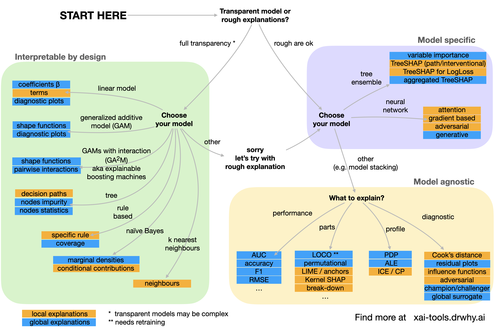
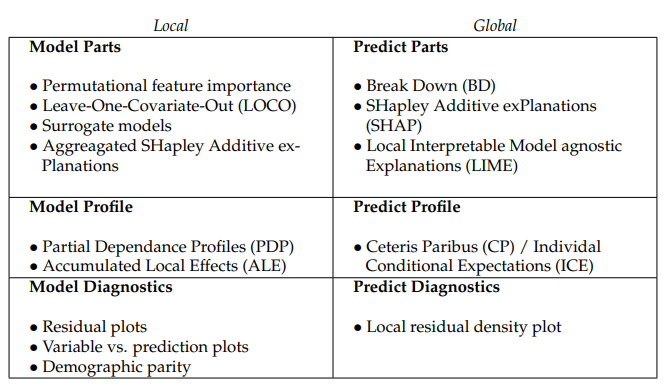

# Landscape of R packages for eXplainable Artificial Intelligence

This repository is a landing page for the article: [Szymon
Maksymiuk](https://www.linkedin.com/in/szymon-maksymiuk/), [Alicja
Gosiewska](https://www.linkedin.com/in/alicja-gosiewska/), and
[Przemysław Biecek](https://www.linkedin.com/in/pbiecek/). *Landscape
of R packages for eXplainable Artificial Intelligence*. It contains data
and code necessary to reproduce all analysis made in the paper.

** Link to the work:   **
<a href="https://mi2datalab.github.io/XAI-tools/ALEplot.html">TBA</a>

In order to cite our work please use the following BiBTeX entry

    Here will be bibtex

# Abstract

The growing availability of data and computing power fuels the
development of predictive models. In order to ensure the safe and
effective functioning of such models, we need methods for exploration,
debugging, and validation. New methods and tools for this purpose are
being developed within the eXplainable Artificial Intelligence (XAI)
subdomain of machine learning. In this work (1) we present the taxonomy
of methods for model explanations, (2) we identify and compare 27
packages available in R to perform XAI analysis, (3) we present an
example of an application of particular packages, (4) we acknowledge
recent trends in XAI. The article is primarily devoted to the tools
available in R, but since it is easy to integrate the Python code, we
will also show examples for the most popular libraries from Python.

# Proposed taxonomy

An important part of our article is a discussion about Taxonomies for
predictive machine learning model explanations. We divided them into
three branches, ie. models interpretable by design, model-specific
explanations, and model-agnostics explanations. Visualization of our
ideas can be seen in the figure below

Furthermore, model-specific and model-agnostic were divided according to
XAI taxonomy we propose as a new way to categorize predictive model
explanations.

# Packages demo

During the work under the article, we have created a markdown with an
example of usage of every compared package. The results can be seen
below. As teaser figures used in the article are presented.

Partial Dependence Porfiles for fare variable from the Titanic data set
generated with DALEX(top-left), flashlight(right-top), iml(left-bottom),
pdp(right-bottom). We can see that the profiles differs. It is due to
the fact that profiles are evaluated on different grids of points.

Contribution plots based on Shapley values for the same observation from
Titanic dataset generated with DALEX (top-left), flashlight (right-top),
iml (left-bottom), pdp (right-bottom).

<a href="https://mi2datalab.github.io/XAI-tools/ALEplot.html">ALEplot</a>
 
<a href="https://mi2datalab.github.io/XAI-tools/arules.html">arules</a>
 
<a href="https://mi2datalab.github.io/XAI-tools/auditor.html">auditor</a>
 
<a href="https://mi2datalab.github.io/XAI-tools/ctree.html">ctree</a>
 
<a href="https://mi2datalab.github.io/XAI-tools/DALEX.html">DALEX</a>
 
<a href="https://mi2datalab.github.io/XAI-tools/DALEXtra.html">DALEXtra</a>
  <a href="https://mi2datalab.github.io/XAI-tools/EIX.html">EIX</a>
 
<a href="https://mi2datalab.github.io/XAI-tools/ExplainPrediction.html">ExplainPrediction</a>
 
<a href="https://mi2datalab.github.io/XAI-tools/fairness.html">fairness</a>
 
<a href="https://mi2datalab.github.io/XAI-tools/fastshap.html">fastshap</a>
 
<a href="https://mi2datalab.github.io/XAI-tools/flashlight.html">flashlight</a>
 
<a href="https://mi2datalab.github.io/XAI-tools/forestmodel.html">forestmodel</a>
 
<a href="https://mi2datalab.github.io/XAI-tools/fscaret.html">fscaret</a>
 
<a href="https://mi2datalab.github.io/XAI-tools/glmnet.html">glmnet</a>
 
<a href="https://mi2datalab.github.io/XAI-tools/iBreakDown.html">iBreakDown</a>
 
<a href="https://mi2datalab.github.io/XAI-tools/ICEbox.html">ICEbox</a>
  <a href="https://mi2datalab.github.io/XAI-tools/iml.html">iml</a>
 
<a href="https://mi2datalab.github.io/XAI-tools/ingredients.html">ingredients</a>
 
<a href="https://mi2datalab.github.io/XAI-tools/kknn.html">kknn</a>
 
<a href="https://mi2datalab.github.io/XAI-tools/naivebayes.html">naivebayes</a>
 
<a href="https://mi2datalab.github.io/XAI-tools/lime.html">lime</a>
 
<a href="https://mi2datalab.github.io/XAI-tools/live.html">live</a>
  <a href="https://mi2datalab.github.io/XAI-tools/mcr.html">mcr</a>
 
<a href="https://mi2datalab.github.io/XAI-tools/modelDown.html">modelDown</a>
 
<a href="https://mi2datalab.github.io/XAI-tools/modelStudio.html">modelStudio</a>
  <a href="https://mi2datalab.github.io/XAI-tools/pdp.html">pdp</a>
 
<a href="https://mi2datalab.github.io/XAI-tools/randomForestExplainer.html">randomForestExplainer</a>
 
<a href="https://mi2datalab.github.io/XAI-tools/shapper.html">shapper</a>
 
<a href="https://mi2datalab.github.io/XAI-tools/smbinning.html">smbinning</a>
 
<a href="https://mi2datalab.github.io/XAI-tools/survxai.html">survxai</a>
  <a href="https://mi2datalab.github.io/XAI-tools/vip.html">vip</a>
 
<a href="https://mi2datalab.github.io/XAI-tools/vivo.html">vivo</a>
 

Versions of all used packages are stored in the renv.lock file and can
be restored with the `renv` package.

# Contributions

We did our best to show the entire range of the implemented
explanations. Please note that the examples may be incomplete. If you
think something is missing, feel free to make a pull request in this
repository.
